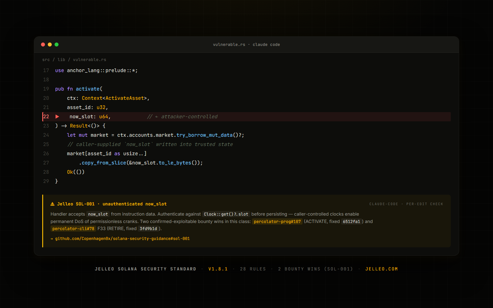

# Solana Security Guidance

> The **Solana Security Standard** — `SOL-0XX` rules for Anthropic's Claude Code security-guidance plugin. By the team that finds the bugs.



[](https://github.com/Copenhagen0x/solana-security-guidance/actions/workflows/validate.yml)
[](LICENSE)
[](CHANGELOG.md)
[-orange)](https://jelleo.com/cycles)

Drop these two files into your Solana project's `.claude/` directory and your IDE will flag Solana-specific bugs while you code — caller-controlled clock values, cross-market state asymmetry, wrapper handlers that drift from engine logic, missing Anchor constraints, and 24 more bug classes drawn from real audits.

## Install in Claude Code (30 seconds)

```bash
mkdir -p .claude && \
  curl -sL https://raw.githubusercontent.com/Copenhagen0x/solana-security-guidance/main/claude-security-guidance.md \
       -o .claude/claude-security-guidance.md && \
  curl -sL https://raw.githubusercontent.com/Copenhagen0x/solana-security-guidance/main/security-patterns.yaml \
       -o .claude/security-patterns.yaml
```

Then make sure you have Anthropic's security-guidance plugin installed:

```text
/plugin install security-guidance@claude-plugins-official
/reload-plugins
```

Done. Open a Solana program file in Claude Code and the plugin will catch issues as you write.

## Run it in CI — GitHub Action

Gate every pull request on the standard. The same SOL-0XX patterns run as a check, with inline annotations on the diff:

```yaml
# .github/workflows/solana-security.yml
name: Solana Security Standard
on: [pull_request]
permissions:
  contents: read
  security-events: write   # optional — enables inline PR annotations
jobs:
  scan:
    runs-on: ubuntu-latest
    steps:
      - uses: actions/checkout@v4
      - uses: Copenhagen0x/solana-security-guidance@v1
        with:
          paths: ./programs        # what to scan (default: .)
          # fail-on-findings: true # red X on findings (default)
          # upload-sarif: true     # GitHub code scanning (default)
```

Then show the world you adopt it — drop this badge in your README:

```md
[](https://github.com/Copenhagen0x/solana-security-guidance)
```

[](https://github.com/Copenhagen0x/solana-security-guidance)

## Run it from the CLI

```bash
npx @jelleo/solana-security-standard scan ./programs
```

Human, JSON, or SARIF output; exits non-zero on findings (so it gates any CI). Zero dependencies. Details in [`cli/`](cli/).

## Run it in your editor — VS Code / Cursor / Windsurf

The [VS Code extension](extensions/vscode) shows SOL-0XX findings as inline warning squiggles as you
type, in any `.rs` file. Same engine as the CLI, 100% local (no telemetry). Works in VS Code, Cursor,
and Windsurf. Details in [`extensions/vscode/`](extensions/vscode/).

## Run it with Semgrep

Already have a Semgrep pipeline? Point it at the [ported ruleset](semgrep):

```bash
semgrep --config https://raw.githubusercontent.com/Copenhagen0x/solana-security-guidance/main/semgrep/solana-security-standard.yaml ./programs
```

The same SOL-0XX rules as `pattern-regex` rules. Details in [`semgrep/`](semgrep/).

## Use it in your AI coding agent — Codex · Copilot · Cursor · Windsurf · Cline · Aider

Most AI coding tools read a rules/instructions file. [`integrations/`](integrations/) ships the SOL-0XX
standard in each tool's native format — all generated from the one source — so your assistant writes
**and reviews** Solana/Anchor code against the rules. Copy the file for your tool (full matrix in
[`integrations/README.md`](integrations/README.md)):

| Tool | Copy into your repo |
| --- | --- |
| Codex / any `AGENTS.md` agent | `integrations/codex/AGENTS.md` |
| GitHub Copilot | `integrations/copilot/.github/copilot-instructions.md` |
| Cursor | `integrations/cursor/.cursor/` |
| Windsurf | `integrations/windsurf/.windsurf/` |
| Cline | `integrations/cline/.clinerules` |
| Aider | `integrations/aider/` (with an optional scanner lint command) |

## Use it via MCP — any MCP client

Prefer the [Model Context Protocol](mcp/)? The [MCP server](mcp/) gives any MCP client (Cline, Copilot,
Cursor, Claude, Windsurf) a `scan_solana_code` tool plus the full rule set — no file to copy:

```json
{ "mcpServers": { "solana-security-standard": { "command": "npx", "args": ["-y", "@jelleo/solana-security-mcp"] } } }
```

100% local, same scanner as the CLI. Details in [`mcp/`](mcp/).

## Learn from real exploits — the Solana Hacks Database

[`hacks/`](hacks/) maps real, disclosed Solana exploits to the SOL-0XX rule class each one falls under —
Wormhole, Mango Markets, Cashio, Crema, Nirvana, Cypher, Loopscale, and more (**$500M+** in documented
losses). Every entry is cited, and incidents no code rule can prevent (stolen keys, off-chain wallets)
are flagged as such rather than misattributed — the same honesty the rest of this repo holds itself to.
Browse the [database →](hacks/README.md).

## Every rule, explained — [`content/`](content/)

[`content/`](content/) is a standalone explainer for **all 28 rules**: what each catches, the fix, whether
it is machine-checkable or review-only, the real exploits in that class (cross-linked to the Hacks
Database), and a code example where one exists. One page per rule — all generated from the standard +
patterns + hacks + examples, so nothing drifts.

## What you get

28 rules covering the dominant Solana program bug classes. **SOL-001 covers two confirmed-exploitable bounty wins (the same caller-controlled `now_slot` class fixed in both the ACTIVATE and RETIRE branches of percolator).** The remaining 27 rules are drawn from documented Solana audit patterns — some from our published disclosures (with maintainer triage classifications noted in the Source column), some from public bug-class taxonomy.

| Rule | Catches | Source |
|---|---|---|
| [SOL-001](claude-security-guidance.md#sol-001--unauthenticated-now_slot) | Unauthenticated `now_slot` / clock spoofing | **Bounty wins (2):** [percolator-prog#107](https://github.com/aeyakovenko/percolator-prog/issues/107) ACTIVATE + [percolator-cli#78](https://github.com/aeyakovenko/percolator-cli/issues/78) F33 RETIRE |
| [SOL-002](claude-security-guidance.md#sol-002--cross-market-state-asymmetry) | Cross-market state asymmetry → counter inflation | Documented public class ([percolator-prog#104](https://github.com/aeyakovenko/percolator-prog/issues/104)) — not our bounty |
| [SOL-003](claude-security-guidance.md#sol-003--wrapper-re-implements-engine) | Wrapper handler re-implements engine logic | Pattern from our [#78](https://github.com/aeyakovenko/percolator-cli/issues/78) F1 — maintainer fixed in-flight, not bountied |
| [SOL-004](claude-security-guidance.md#sol-004--penaltyhealth-terms-omitted) | Health/penalty terms omitted from calc | Pattern from our [#78](https://github.com/aeyakovenko/percolator-cli/issues/78) F2 — engine-side, separate disclosure pending |
| [SOL-005](claude-security-guidance.md#sol-005--anchor-resize-without-checks) | Anchor `realloc()` without guards | Latent pattern from our [#78](https://github.com/aeyakovenko/percolator-cli/issues/78) F12 — reachable when 14-asset cap lifted |
| [SOL-006](claude-security-guidance.md#sol-006--missing-signer-check) | Missing signer check on privileged handler | Generic Solana |
| [SOL-007](claude-security-guidance.md#sol-007--missing-owner-verification) | Missing `account.owner == program_id` | Generic Solana |
| [SOL-008](claude-security-guidance.md#sol-008--unverified-pda) | Unverified PDA derivation | Generic Solana |
| [SOL-009](claude-security-guidance.md#sol-009--cpi-without-authority-check) | CPI without authority check | Generic Solana |
| [SOL-010](claude-security-guidance.md#sol-010--reinit-attack) | Reinit attack via `init_if_needed` | Generic Solana |
| [SOL-011](claude-security-guidance.md#sol-011--lamport-drain-via-close) | Lamport drain via account closure | Generic Solana |
| [SOL-012](claude-security-guidance.md#sol-012--rent-exemption-check-missing) | Rent exemption check missing | Generic Solana |
| [SOL-013](claude-security-guidance.md#sol-013--token-program-id-confusion) | Token Program ID confusion (Token vs Token-2022) | Generic Solana |
| [SOL-014](claude-security-guidance.md#sol-014--unchecked-integer-arithmetic) | Unchecked integer arithmetic | Generic Solana |
| [SOL-015](claude-security-guidance.md#sol-015--anchor-constraints-missing) | Anchor `has_one`/`constraint=` missing | Generic Anchor |
| [SOL-016](claude-security-guidance.md#sol-016--bump-seed-unvalidated) | Bump seed not validated against canonical bump | Generic Solana |
| [SOL-017](claude-security-guidance.md#sol-017--raw-accountinfo-without-typed-deserialize) | Raw `AccountInfo` without typed deserialize | Generic Solana |
| [SOL-018](claude-security-guidance.md#sol-018--hardcoded-system-program-id) | Hardcoded System Program ID literal | Generic Solana |
| [SOL-019](claude-security-guidance.md#sol-019--missing-discriminator-check) | Missing discriminator check on deserialize | Generic Solana |
| [SOL-020](claude-security-guidance.md#sol-020--setauthority-without-verification) | `SetAuthority` without prior verification | Generic Solana |
| [SOL-021](claude-security-guidance.md#sol-021--terminal-op-gated-on-a-live-only-condition) | Terminal/close op gated on a live-only condition → funds lock | **Jelleo v16 audit F1** — maintainer fixed as "Finding C" |
| [SOL-022](claude-security-guidance.md#sol-022--write-only-impaired-counter) | Write-only "impaired" counter never decremented → funds encumbered | **Jelleo v16 audit F2** — [percolator#74](https://github.com/aeyakovenko/percolator/issues/74), code-confirmed |
| [SOL-023](claude-security-guidance.md#sol-023--feepenalty-rounds-toward-the-user) | Fee/penalty rounds toward the user → evasion + leakage | **Jelleo v16 audit F3** (Low) |
| [SOL-024](claude-security-guidance.md#sol-024--stale--unchecked-oracle-price) | Stale / unchecked Pyth/Switchboard oracle price | Generic Solana DeFi |
| [SOL-025](claude-security-guidance.md#sol-025--sysvar-read-by-raw-deserialize) | Sysvar read by raw deserialize (not `Clock::get()`) | Generic Solana |
| [SOL-026](claude-security-guidance.md#sol-026--duplicate-mutable-account-native-programs) | Duplicate mutable account unchecked (native + Anchor `AccountLoader`/`remaining_accounts`) | Generic Solana |
| [SOL-027](claude-security-guidance.md#sol-027--unvalidated-remaining_accounts) | Unvalidated `remaining_accounts` | Generic Solana |
| [SOL-028](claude-security-guidance.md#sol-028--missing-slippage--min-out-bound) | Missing slippage / min-out bound | Generic Solana DeFi |

## Why these rules — honest provenance

We disclose exactly where each rule came from. Some are confirmed-exploitable bounty wins; some are documented patterns we surfaced but the maintainer classified differently in triage. We list both kinds because all of them are real Solana attack surfaces worth flagging — but we don't claim bounty credit we didn't earn.

- **SOL-001 — TWO confirmed-exploitable bounty wins (same class, two code paths).** ACTIVATE branch: [percolator-prog#107](https://github.com/aeyakovenko/percolator-prog/issues/107), fixed in `6512fa1`. RETIRE branch: [percolator-cli#78 F33](https://github.com/aeyakovenko/percolator-cli/issues/78), fixed in `3fd9b1d`. Both maintainer-acknowledged via Lean theorem-prover models. Our suggested `authenticated_slot_or_fallback` patch shipped verbatim.
- **SOL-002 — public class, not our bounty.** The cross-market `pnl_pos_bound_tot` inflation class was publicly disclosed at [percolator-prog#104](https://github.com/aeyakovenko/percolator-prog/issues/104) by another researcher. Included because the pattern is reproducible across perp-DEX programs.
- **SOL-003, SOL-004, SOL-005 — patterns from our bounty 5 disclosure.** All three were in our [#78](https://github.com/aeyakovenko/percolator-cli/issues/78) submission (36 findings total). Maintainer triage outcomes: F1 already fixed in `0925ed4` before triage; F2 engine-side (separate disclosure pending at `aeyakovenko/percolator`); F12 latent (reachable when the 14-asset cap is lifted). Real Solana patterns worth flagging in future code, none paid as new bounties.

- **SOL-021, SOL-022, SOL-023 — patterns from our percolator v16 engine audit.** F1 (terminal-close deadlock) was fixed by the maintainer as "Finding C". F2 (write-only impaired insurance counter) is disclosed at [percolator#74](https://github.com/aeyakovenko/percolator/issues/74) — code-confirmed, not yet reproduced on-chain. F3 (fee rounding) is Low. Code-analysis patterns, not claimed as paid bounties.

The remaining rules (SOL-006 through SOL-020, plus SOL-024 through SOL-028) cover documented Solana / DeFi audit patterns — signer/owner/PDA verification, Anchor constraints, CPI authority, lamport drains, Token Program ID confusion, integer overflow, oracle staleness, slippage bounds, etc. Standard auditor checklist territory.

All published cycle reports: [jelleo.com/cycles](https://jelleo.com/cycles)

## How it works

Anthropic's [security-guidance plugin](https://code.claude.com/docs/en/security-guidance) reviews Claude's code edits at three layers:

1. **On each file edit** — fast pattern match (no model call). Reads `.claude/security-patterns.yaml` for regex/substring rules. **Our file provides 17 deterministic patterns.**
2. **At the end of each turn** — background model review of the full diff. Reads `.claude/claude-security-guidance.md` for semantic guidance. **Our file provides the Solana threat model + 28-rule catalog + review checklist.**
3. **On each commit Claude makes** — deeper agentic review that reads surrounding code. Uses the same guidance file.

Every time a rule fires, the reminder text includes the rule ID (e.g. `Jelleo SOL-001:`) and a link back to this repo so you can see the underlying bounty case study.

## Examples

The [`examples/`](examples/) directory contains 5 paired vulnerable/fixed Solana snippets — one per headline rule. Useful for understanding the bug class before reading the rule definition.

## Contributing

PRs welcome — especially:
- New rules drawn from your own audits (please include a reference to the disclosed finding)
- Tightened regexes that reduce false positives
- Additional vulnerable/fixed example pairs

Open an issue first if you're proposing a new rule category. Keep rules focused: each one should catch a single bug class with a low false-positive rate. Quality over quantity.

## Versioning

This repo follows [Semantic Versioning](https://semver.org/). Tagged releases are safe to pin in your `.claude/` directory:

```bash
curl -sL https://raw.githubusercontent.com/Copenhagen0x/solana-security-guidance/v1.0.0/claude-security-guidance.md \
     -o .claude/claude-security-guidance.md
```

See [CHANGELOG.md](CHANGELOG.md) for the full version history.

## License

[MIT](LICENSE) — use anywhere, attribution appreciated.

## Maintained by

[**Jelleo**](https://jelleo.com) — continuous Solana program audits. Every cycle is Ed25519-signed and Merkle-rooted; all artifacts public at [jelleo.com/cycles](https://jelleo.com/cycles).

Each new bounty cycle we publish adds rules to this guidance. If you want a deeper audit of your Solana program, see [jelleo.com](https://jelleo.com).
